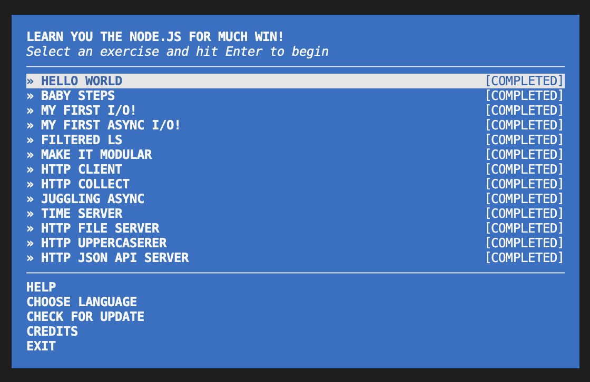

# comp584-project6

## Sources

- Node.js Documentation: https://nodejs.org/api/
- learnyounode Workshop: https://github.com/workshopper/learnyounode
- through2-map: https://www.npmjs.com/package/through2-map
- Buffer List (bl): https://www.npmjs.com/package/bl
- MDN Web Docs: https://developer.mozilla.org/
